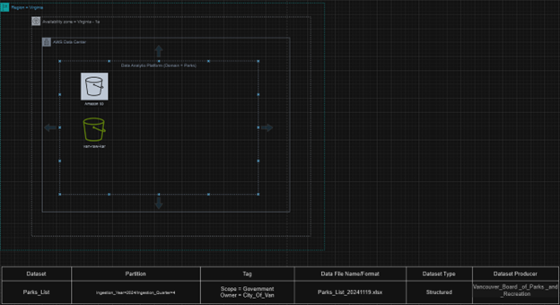

# **Vancouver Parks Data Analytics Projects**

This portfolio highlights a series of data analytics projects aimed at analyzing Vancouver parks' usage and trends. The projects make use of advanced AWS services to ensure secure data storage, processing, analysis, and visualization, while providing valuable insights for city planners and stakeholders. Each project focuses on different aspects of park data and integrates AWS tools for scalable, efficient, and insightful data management.

---

## **1. Exploratory Data Analysis (EDA) on Vancouver Parks Data**  
**Project Title**: Exploring Vancouver Parks: An EDA Approach  

### **Objective**  
Perform exploratory data analysis (EDA) to uncover patterns in park usage, amenities, and geographic distribution. The goal is to understand relationships between park attributes and visitor trends to inform city planning decisions.

### **Dataset**  
- **Park ID**: Unique identifier for each park  
- **Park Name**: Name of the park  
- **Location**: Geographic coordinates (latitude, longitude)  
- **Size**: Area of the park in hectares  
- **Amenities**: List of facilities (e.g., playgrounds, trails, sports fields)  
- **Visitor Count**: Monthly or yearly visitor data  
- **Type**: Park type (e.g., community, regional, nature park)  

### **Methodology**  
- **Data Storage & Management**  
  - Store raw data in **Amazon S3** for scalable object storage.

